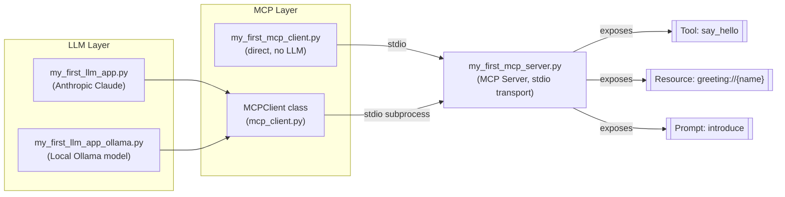
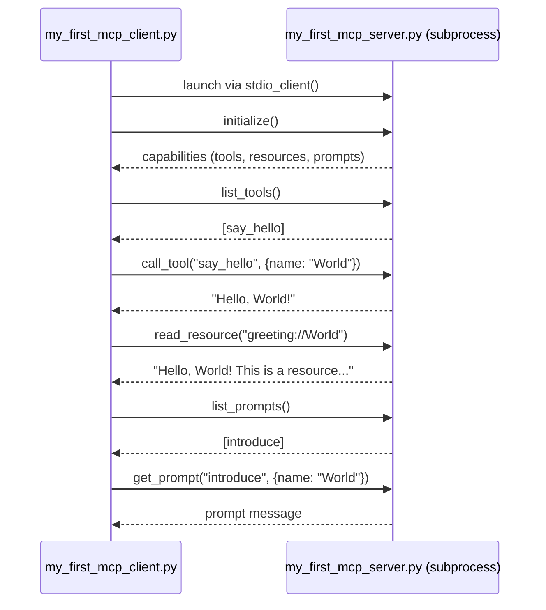
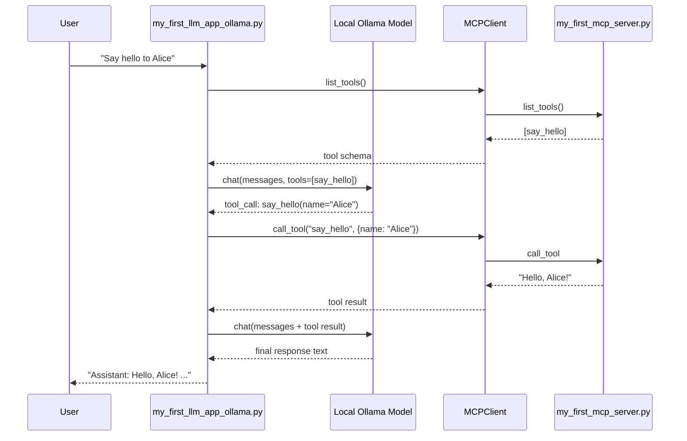
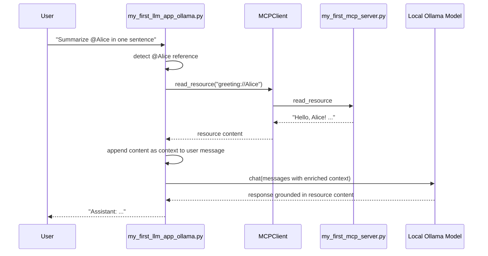

# MCP Learning Project

This project is a hands-on introduction to the **Model Context Protocol (MCP)** and how LLMs use it to call tools, read resources, and use prompts. It contains a progression of examples, from simplest to most complete:

| File | What it is |
| --- | --- |
| [my_first_mcp_server.py](my_first_mcp_server.py) | A minimal MCP **server** exposing one tool, one resource, and one prompt |
| [my_first_mcp_client.py](my_first_mcp_client.py) | A minimal MCP **client** that connects to the server directly (no LLM involved) |
| [my_first_llm_app.py](my_first_llm_app.py) | An LLM app that lets **Claude** (Anthropic API) call the server's tool |
| [my_first_llm_app_ollama.py](my_first_llm_app_ollama.py) | An interactive LLM app that lets a **local, free Ollama model** call the server's tool |
| [mcp_server.py](mcp_server.py) / [mcp_client.py](mcp_client.py) / [main.py](main.py) | The full-featured document-chat CLI application (see [Full Application](#full-application-mcp-chat) below) |

> Looking for the previous README? See [README.old.md](README.old.md).

## Why this matters

MCP standardizes how an application exposes **tools** (actions an LLM can invoke), **resources** (data an LLM/app can read), and **prompts** (reusable prompt templates) to any MCP-compatible client or LLM. Once a server implements MCP, any MCP client — including different LLM backends — can use it without custom integration code per tool.

## Architecture



The server communicates over **stdio** — the client launches it as a subprocess and talks to it via JSON-RPC messages on stdin/stdout. This means the server and client must be run from the same machine/session (the client starts the server for you; you don't need to start it separately).

## Prerequisites

- Python 3.10+
- [uv](https://github.com/astral-sh/uv) (this project's dependency manager)
- For the Claude app: an Anthropic API key (paid)
- For the Ollama app: [Ollama](https://ollama.com) installed locally (free, runs on your machine)

### Install dependencies

```bash
uv venv
source .venv/bin/activate   # Windows: .venv\Scripts\activate
uv pip install -e .
```

This installs everything needed for all examples in the table above, including the `mcp`, `anthropic`, and `ollama` packages.

---

## 1. MCP Server — `my_first_mcp_server.py`

A minimal MCP server built with `FastMCP`. It exposes:

- **Tool** `say_hello(name)` — returns a greeting string
- **Resource** `greeting://{name}` — returns greeting text as a resource
- **Prompt** `introduce(name)` — returns a prompt template asking the LLM to write an introduction

You normally don't run this file directly — MCP clients launch it as a subprocess. But you can sanity-check it starts without errors:

```bash
.venv/bin/python my_first_mcp_server.py
```

It will sit waiting for stdio input; press `Ctrl+C` to stop it. This is expected — it's designed to be driven by a client, not used interactively.

## 2. MCP Client — `my_first_mcp_client.py`

A minimal client that launches the server, calls its tool/resource/prompt directly, and prints the results. **No LLM is involved** — good for validating the MCP server plumbing works correctly on its own.

### Run it

```bash
.venv/bin/python my_first_mcp_client.py
```

### Expected output

```
Available tools: ['say_hello']
Tool result: Hello, World!
Resource result: Hello, World! This is a resource, not a tool response.
Available prompts: ['introduce']
Prompt result: Write a short, friendly introduction for a person named World.
```

### Sequence diagram



---

## 3. LLM App (Claude / Anthropic) — `my_first_llm_app.py`

Lets **Claude** decide when to call the server's `say_hello` tool. Uses the shared `Claude`, `MCPClient`, and `ToolManager` helpers in [core/](core/).

### Requires

An Anthropic API key. Add it to `.env`:

```text
ANTHROPIC_API_KEY=sk-ant-...
CLAUDE_MODEL=claude-sonnet-5
```

### Run the Claude app

```bash
.venv/bin/python my_first_llm_app.py
```

It sends the prompt "Say hello to Alice", lets Claude call the tool if it chooses to, and prints Claude's final response.

> No Anthropic API key? Use the free, local Ollama version below instead.

---

## 4. LLM App (Local, Free) — `my_first_llm_app_ollama.py`

Same idea as above, but uses a **local model via Ollama** — completely free, no API key, runs on your machine. This is an **interactive chat loop**: it keeps conversation history across turns and calls the MCP tool whenever the model decides to. It also supports pulling context from an MCP **resource** into the LLM prompt (see [Resource Context](#resource-context-name) below).

### One-time setup

1. Install Ollama:

   ```bash
   brew install ollama
   brew services start ollama
   ```

1. Pull a small tool-calling-capable model (~1GB):

   ```bash
   ollama pull qwen2.5:1.5b
   ```

> Larger models (`llama3.2:3b`, `llama3.1`) tend to be more reliable at invoking tools correctly, at the cost of a bigger download. `qwen2.5:1.5b` is used here to keep the download small for quick validation.

### Run the Ollama app

```bash
.venv/bin/python my_first_llm_app_ollama.py
```

### Example session

```text
Chat with the local Ollama model (Ctrl+C or 'exit' to quit).
You: Say hello to Bob
Assistant: Hello, Bob! How can I assist you further?
You: exit
```

### Sequence diagram (tool-calling loop)



### Resource Context (`@name`)

In addition to tool calling, the Ollama app can pull an MCP **resource's** content into the LLM prompt as context — separate from the tool-calling loop above. Reference a resource in your chat message with `@name`, and its content (fetched from `greeting://{name}`) is appended to your message before it's sent to the model:

```text
You: Summarize @Alice in one sentence
```

is expanded internally to:

```text
Summarize @Alice in one sentence

Context from MCP resources:
[Resource greeting://Alice]
Hello, Alice! This is a resource, not a tool response.
```

> Note: response quality depends on the model. `qwen2.5:1.5b` sometimes reasons weakly over injected context — try `llama3.2:3b` for more reliable grounding.

#### Sequence diagram (resource context)



---

## Full Application: MCP Chat

The original, full-featured app in this repo — [main.py](main.py) — is a document-chat CLI that uses [mcp_server.py](mcp_server.py) (a document store with read/edit tools, list/fetch resources, and format/summarize prompts) and [mcp_client.py](mcp_client.py)/[core/](core/) (a fuller MCPClient + Claude + tool-orchestration loop with a proper CLI).

### Setup

1. Add your Anthropic API key to `.env`:

   ```text
   ANTHROPIC_API_KEY=""
   CLAUDE_MODEL=""
   ```

1. Run it:

   ```bash
   uv run main.py
   ```

### Usage

- **Basic chat** — type a message and press Enter.
- **Document retrieval** — reference a document with `@`:

  ```text
  > Tell me about @deposition.md
  ```

- **Commands** — run an MCP prompt with `/`:

  ```text
  > /summarize deposition.md
  ```

  Commands auto-complete with Tab.

### Development

- Add new documents by editing the `docs` dictionary in `mcp_server.py`.
- Extend the server by completing the TODOs in `mcp_server.py`, and update `mcp_client.py`/`core/tools.py` if you add new capability types.
- There are no lint or type checks configured in this project.

---

## Validation Checklist (for team review)

- [ ] `my_first_mcp_client.py` runs and prints tool/resource/prompt output with no LLM involved
- [ ] `my_first_llm_app_ollama.py` runs locally with no API key and correctly triggers the `say_hello` tool
- [ ] `my_first_llm_app_ollama.py` correctly expands `@name` into resource context from `greeting://{name}`
- [ ] `my_first_llm_app.py` runs with a valid Anthropic key and correctly triggers the `say_hello` tool
- [ ] `main.py` runs the full document-chat CLI and can retrieve/summarize documents
